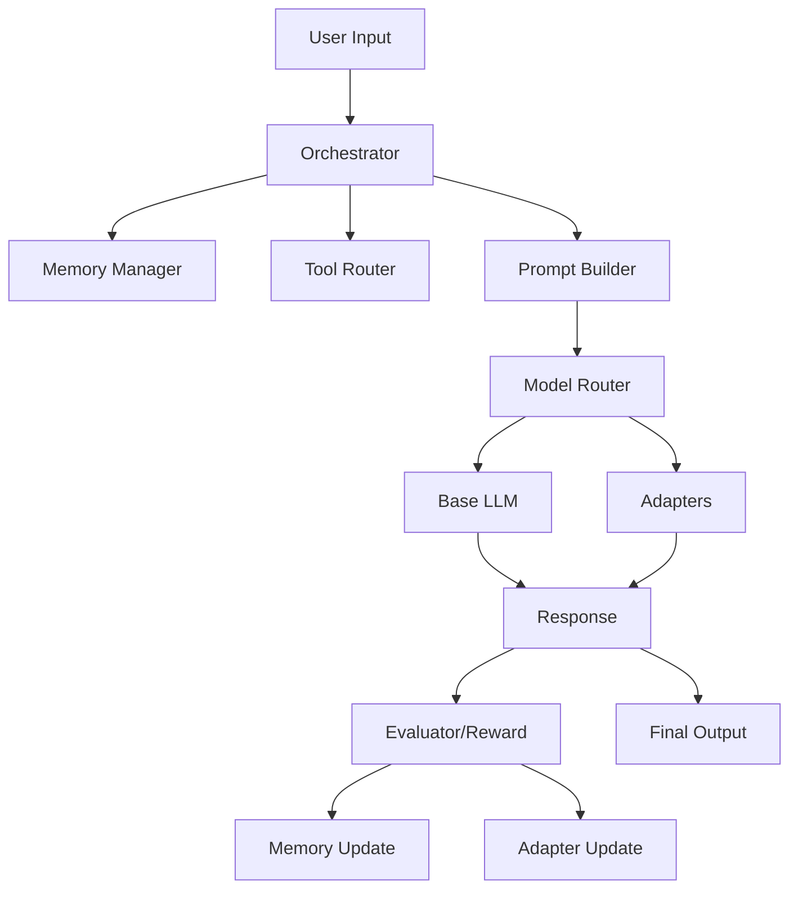

# GPT\_5 Child 👶🤖

> An open-source project to build a **programmatic child** that continuously learns from interactions and experiments inside a system environment, inspired by how human children develop intelligence.

---

## ✨ Concept

Just like a human child is born with innate foundations (senses, reflexes, curiosity) and then learns through experience — **GPT\_5 Child** is born with a linguistic base (Base LLM) but grows and develops itself through:

* **Writing** and experimenting instead of sensory input.
* **Tools** (Sandbox, DB, Web, API calls).
* **Short-term and long-term memory** (STM/LTM).
* **Continual learning** via Adapters (LoRA) and Replay.
* **Curiosity and reward mechanisms** to evaluate experiences and consolidate useful ones.

---

## 🧩 Architecture Overview

* **Orchestrator**: The brain that directs interactions.
* **Memory Manager**: STM + LTM using a Vector DB.
* **Tool Router**: Connects to external tools.
* **Base LLM + Adapters**: The core brain with acquired skills.
* **Trainer/Updater**: Continuously updates adapters.
* **Evaluator/Reward Model**: Judges quality and feedback.



---

## 🚀 Goals

* Develop a system for **continual AI learning**.
* Encourage researchers and engineers to explore **cognitive growth models**.
* Create an open collaborative environment to evolve the idea.

---

## 📥 Getting Started

1. **Clone the repository**

```bash
git clone https://github.com/aymen-95/gpt5_child.git
cd gpt5_child
```

2. **Run the experiment environment** (Docker/venv).
3. Explore initial code and start experimenting.

---

## 🛠️ Contributing

* We welcome ideas, PRs, and suggestions.
* You can develop new tools, improve memory management, or design better reward mechanisms.
* Open Issues or join the Discussions.

---

## ⚖️ Intellectual Property

* The core concept is original and **credited to the founder**.
* Contributions are open-source under MIT License, but **conceptual ownership is reserved**.
* The goal: share the vision globally and grow it collaboratively.

---

## 🌐 Contact

* Founder: \[Your Name]
* Email: \[Your Email]
* Twitter/LinkedIn: \[Your Links]

---

> *“GPT\_5 Child is an attempt to embody how AI can grow like a child — starting weak, but through experience and memory, becoming more intelligent and mature over time.”*
